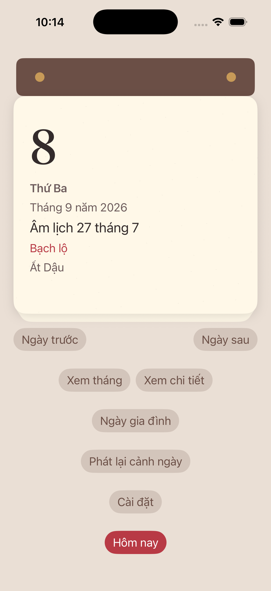
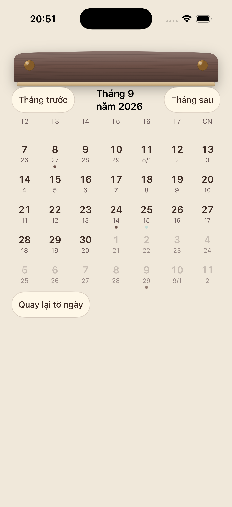
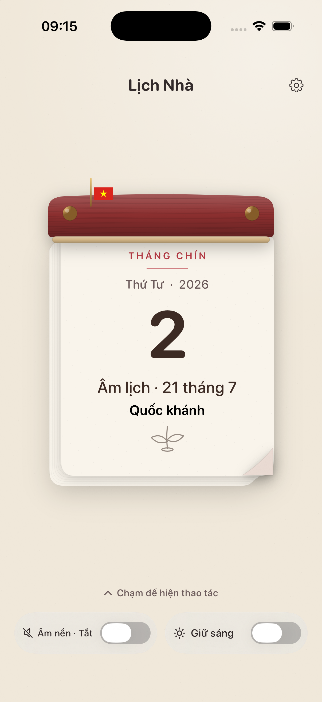

# Lịch Nhà

[](LICENSE)

Lịch bloc Việt Nam trên iPhone. Mở app là tờ hôm nay: ngày dương, ngày âm, Can Chi. Kéo hoặc bấm để đổi ngày, tra tháng, tạo ngày giỗ, xem nguồn. Miễn phí, không quảng cáo, không đăng nhập. Lõi chạy offline.

English: Lịch Nhà is a Vietnamese tear-off calendar for iPhone (iOS 17+, Swift 6). Working name, not the App Store title. Source and original project docs are Apache 2.0. See `LICENSE` and `NOTICE`.

## Trạng thái

Bản Simulator đã có sáu user story (tờ ngày, tháng, nguồn, ngày gia đình, widget snapshot, cảnh/âm, cài đặt). T020 ký `READY WITH WAIVERS` ngày 08/09/2026. Gate 1–7 vẫn `UNTESTED`. Báo cáo hội tụ: `NOT CONVERGED`. Chưa archive, chưa TestFlight, chưa nộp store.

| Có | Chưa |
|---|---|
| App Debug trên Simulator iPhone | Buổi người thật (T012–T016, T144) |
| Pack luật 1.1.0 (Điều 112 + 24/11) và lịch năm 2026 | Reviewer nội dung thứ hai (T147) |
| Ảnh hiện trạng trong `LichNha/Tests/Screenshots/current/` | Ảnh App Store Connect |
| Engine `lich-nha-cal-1`, UTC+7, phạm vi 1900–2100 | Hai oracle lịch độc lập (T017) |

## Ảnh hiện trạng

Chụp Simulator, ghi đè khi UI đổi. Không phải bộ screenshot store.

| Tờ hôm nay | Tháng | Quốc khánh 2/9 |
|---|---|---|
|  |  |  |

Các file còn lại: `detail.png`, `events.png`, `editor.png`, `settings.png`. Chụp lại:

```bash
bash tools/capture-current-ui.sh
```

Cần Simulator đã cài `vn.lichnha.app`. Mặc định dùng iPhone 17; đổi máy bằng `LICH_NHA_SIMULATOR_ID`.

## Chức năng trong binary

- Tờ hôm nay, nút ngày trước/sau, Hôm nay, peel có nút thay thế (44 pt, VoiceOver)
- Tờ tháng, mặt sau, nguồn, cảnh báo phạm vi lịch 1968–1975
- Lớp lịch truyền thống tắt được; ba phương pháp tách; nhãn tham khảo; mặc định ẩn
- Sự kiện âm/dương trên máy, nhắc local, không đọc toàn bộ Lịch iPhone trừ khi người dùng chọn xuất
- Widget snapshot qua App Group; lock screen ẩn tiêu đề riêng
- Cảnh Quốc khánh (cờ dựng tay), Lập Xuân 2D, ngày thường; Reduce Motion dùng poster
- Âm mặc định Yên. Hiên sớm, giấy, cue sự kiện là opt-in. Tôn trọng Silent và VoiceOver

Không có tài khoản, StoreKit, quảng cáo, analytics hay gọi AI lúc chạy.

## Yêu cầu

- macOS với Xcode có SDK iOS 17 (Swift 6)
- [XcodeGen](https://github.com/yonaskolb/XcodeGen)
- Python 3 (validator pack, không cần pip)
- Simulator iPhone; máy thật cần signing và App Group

## Build

```bash
cd LichNha
xcodegen generate
open LichNha.xcodeproj
```

Scheme `LichNha`, bundle `vn.lichnha.app`. Signing Debug trên Simulator: `CODE_SIGN_IDENTITY=-`.

## Kiểm tra

```bash
swift test --package-path LichNha/Modules
python3 tools/pack-validator/test_samples.py
python3 tools/pack-validator/validate.py LichNha/Resources/ContentPacks/official-vn.json
python3 tools/pack-validator/validate.py LichNha/Resources/ContentPacks/official-schedule-2026.json
```

Runbook đầy đủ, gồm `xcodebuild` UI/performance: [specs/001-lich-nha-v1/quickstart.md](specs/001-lich-nha-v1/quickstart.md).

## Cấu trúc

```
LichNha/          app, widget, module, pack, test, ảnh hiện trạng
docs/             nghiên cứu sản phẩm
specs/001-lich-nha-v1/   spec, plan, tasks, analysis, convergence
research/         quyết định, scorecard, desk research
release/          privacy, metadata store, TestFlight (nháp)
tools/            pack validator, capture UI, golden calendar
assets/           storyboard, license audit, Rodin (chưa chạy)
.agents/          skill và workflow cho agent (giấy phép riêng)
```

## Tài liệu

Sản phẩm: [định hướng](docs/00-dinh-huong-san-pham.md), [đặc tả](docs/02-dac-ta-san-pham.md), [UX](docs/03-ux-va-my-thuat.md), [dữ liệu lịch](docs/04-du-lieu-va-do-tin-cay.md), [nguồn](docs/07-nguon-tham-khao.md).

Spec Kit: [constitution](.specify/memory/constitution.md), [spec](specs/001-lich-nha-v1/spec.md), [plan](specs/001-lich-nha-v1/plan.md), [tasks](specs/001-lich-nha-v1/tasks.md), [convergence](specs/001-lich-nha-v1/convergence.md).

Quyết định: [DoR](research/decisions/005-ready-to-code.md), [nguồn lịch](research/decisions/002-calendar-sources.md), [almanac](research/decisions/003-almanac-ruleset.md).

Agent: [AGENTS.md](AGENTS.md), [Design Master](design-system/lich-nha/MASTER.md), [SOURCES.md](.agents/SOURCES.md).

## Giấy phép

Mã gốc và tài liệu do dự án viết: [Apache License 2.0](LICENSE). Copyright 2026 Phạm Huy Đức. Attribution: [NOTICE](NOTICE).

Không nằm trong Apache 2.0:

- Skill trong `.agents/skills/` và Spec Kit trong `.specify/` (MIT, pin trong `.agents/SOURCES.md`)
- Văn bản pháp luật Việt Nam được trích trong content pack (văn bản công; dự án chỉ mã hóa JSON)
- Font hệ thống Apple dùng lúc chạy

Ledger asset trong binary: [assets/release/license-audit.md](assets/release/license-audit.md).
